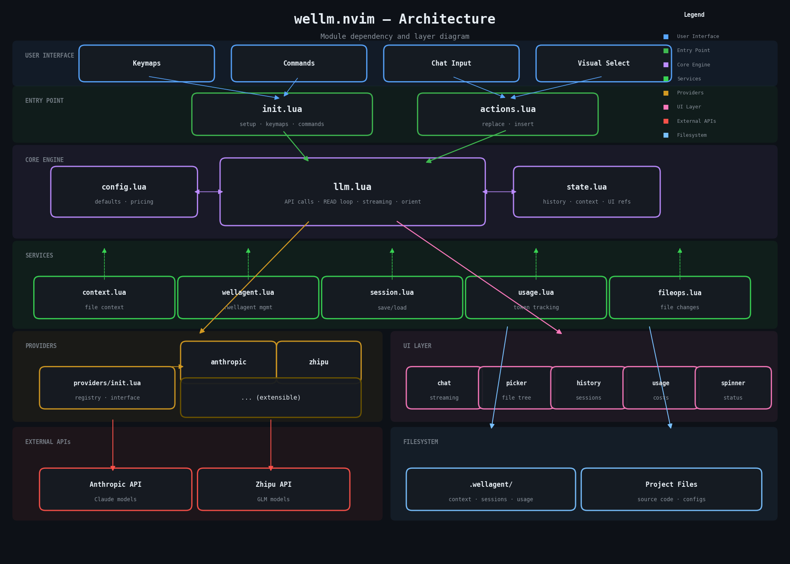
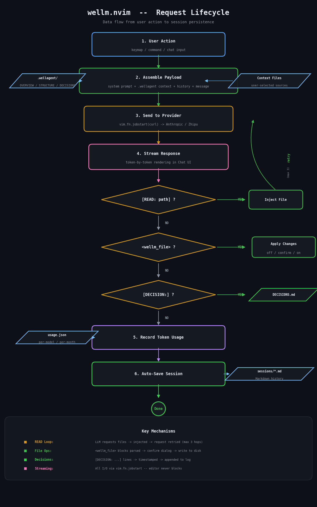

# wellm.nvim

[](LICENSE)
[](https://neovim.io)
[](https://www.lua.org)
[](lua/wellm/providers/)

A fully asynchronous, streaming LLM integration for Neovim. Chat with AI, manage
conversational history, build persistent project context, and let the model read
and write files - all within the vim editor.

wellm.nvim uses a Provider pattern to abstract different LLM APIs (currently Anthropic and
Zhipu, yet easy to extend), separates configuration from runtime state, and
provides a dedicated UI layer for chat windows, history browsers, file pickers,
and usage statistics. The `wellagent` module orchestrates complex multi-step
interactions including automatic project orientation, decision logging, and a
read-loop that lets the LLM request files it needs before answering.

---

## Table of Contents

- [Features](#features)
- [Requirements](#requirements)
- [Installation](#installation)
- [Configuration](#configuration)
- [Providers](#providers)
- [Default Keymaps](#default-keymaps)
- [Commands](#commands)
- [Chat Window](#chat-window)
- [File Picker](#file-picker)
- [Session History](#session-history)
- [Context Management](#context-management)
- [Smart Context & Summarization](#smart-context--summarization)
  - [Rolling Summary Memory](#rolling-summary-memory)
  - [Chunk‑Based File Retrieval](#chunkbased-file-retrieval)
  - [Knowledge Indexing](#knowledge-indexing)
  - [Token Budget Guard](#token-budget-guard)
- [LLM Auto File-Read](#llm-auto-file-read)
- [File Operations](#file-operations)
- [Project Orientation](#project-orientation)
- [Decision Log](#decision-log)
- [Usage and Cost Tracking](#usage-and-cost-tracking)
- [The .wellagent Folder](#the-wellagent-folder)
- [Architecture](#architecture)
- [Adding a New Provider](#adding-a-new-provider)
- [Updating Pricing](#updating-pricing)
- [License](#license)

---

## Features

- **Streaming chat** - tokens appear in real time in a dedicated split-right
  window; no blocking, no waiting for the full response.
- **AI Replace / AI Insert** - select code in visual mode and ask the LLM to
  replace it, or generate new code at the cursor position.
- **Multi-provider** - Anthropic (Claude) and Zhipu (GLM) ship out of the box;
  any OpenAI-compatible API can be added via the provider registry.
- **Auto file-read loop** - the LLM can request project files with
  `[READ: path/to/file]` and the plugin injects them automatically (up to 3
  hops per request to prevent loops).
- **File operations** - the LLM can propose file creations and modifications
  using `<wellm_file>` blocks. Choose between confirm-every-change, auto-apply,
  or disabled modes.
- **Persistent project context** - the `.wellagent/` folder stores an
  LLM-generated project overview, annotated file tree, and a rolling decision
  log, all injected into every request automatically.
- **Project orientation** - one command generates `OVERVIEW.md` and
  `STRUCTURE.md` from your codebase so the LLM always has up-to-date project
  knowledge.
- **Decision logging** - the LLM can emit `[DECISION: summary]` lines that are
  automatically appended to `DECISIONS.md`. Manually log decisions with
  `:WellmDecision`.
- **Session history** - conversations are saved as Markdown files. Browse,
  preview, resume, or delete past sessions from a floating UI.
- **Context file picker** - a floating checkbox tree lets you select which
  project files to include in the LLM's context for the current conversation.
- **Token and cost tracking** - per-model, per-month usage with estimated
  cost based on provider pricing tables.
- **System prompt override** - change the system prompt on the fly with
  `:WellmSystem`.
- **Model switching** - switch models mid-session with `:WellmModel <name>`.
- **Loading spinner** - a non-blocking spinner shows LLM status (thinking,
  reading files, etc.) in the corner of the editor.
- **Fully async** - all API calls run through `vim.fn.jobstart`; the editor
  never freezes.
- **Smart context & summarization** - rolling summary keeps long conversations
  within token limits; chunk‑based file retrieval injects only relevant
  fragments; knowledge index reduces `.wellagent` bloat; token budget guard
  prevents API errors before sending the request.

---

## Requirements

- Neovim 0.9 or later
- `curl` installed and available on `$PATH`
- An API key for at least one supported provider (Anthropic or Zhipu)

---

## Installation

### lazy.nvim

```lua
{
  "wellbek/wellm.nvim",
  config = function()
    require("wellm").setup({
      provider     = "anthropic",
      api_key_name = "ANTHROPIC_API_KEY",
      model        = "claude-sonnet-4-5",
      max_tokens   = 8192,
    })
  end,
}
```

### packer.nvim

```lua
use {
  "wellbek/wellm.nvim",
  config = function()
    require("wellm").setup({
      provider     = "anthropic",
      api_key_name = "ANTHROPIC_API_KEY",
      model        = "claude-sonnet-4-5",
      max_tokens   = 8192,
    })
  end,
}
```

### Manual / vim-plug

```vim
Plug 'wellbek/wellm.nvim'
```

Then in your `init.lua`:

```lua
require("wellm").setup({
  provider     = "anthropic",
  api_key_name = "ANTHROPIC_API_KEY",
  model        = "claude-sonnet-4-5",
})
```

---

## Configuration

Call `require("wellm").setup(opts)` in your Neovim config. All options have
sane defaults; you only need to override what you want to change.

```lua
require("wellm").setup({
  -- Provider and authentication
  provider     = "anthropic",          -- "anthropic" or "zhipu"
  api_key_name = "ANTHROPIC_API_KEY",  -- env var name to read the key from
  api_key      = nil,                  -- or hardcode the key (not recommended)
  model        = "claude-sonnet-4-5",  -- default model
  max_tokens   = 8192,                 -- max tokens per response

  -- File change behavior: how the LLM's <wellm_file> blocks are handled
  -- "filechanges_off"     -- ignore all file change proposals
  -- "filechanges_confirm" -- show a dialog before applying (default)
  -- "filechanges_on"      -- apply changes automatically
  filechanges = "filechanges_confirm",

  -- Wellagent: persistent project context
  wellagent = {
    enabled          = true,
    auto_init        = true,   -- create .wellagent/ on first buffer open
    auto_orient      = true,   -- generate OVERVIEW + STRUCTURE if missing
    max_entries_before_summarize = 8,   -- auto‑condense knowledge category
    ignored_patterns = {
      "%.git", "node_modules", "%.wellagent", "__pycache__",
      "%.pyc", "%.class", "dist", "build", "target", "%.cache",
    },
  },

  -- Session persistence
  sessions = {
    save_automatically = true,            -- save after every LLM response
    max_sessions       = 100,             -- trim oldest sessions beyond this
    summary_turns      = 3,               -- keep this many full turns + rolling summary
  },

  -- Context chunking and expiration
  context = {
    chunk_size    = 50,   -- lines per chunk
    smart_top_k   = 3,    -- best chunks to inject when query given
    item_ttl      = 1,    -- turns before auto‑expiration
  },

  -- Token budget protection
  llm = {
    output_reserve = 1024,  -- tokens reserved for model response
  },

  -- Prompt templates
  prompts = {
    coding = "...",   -- system prompt for replace/insert/orient
    chat   = "...",   -- system prompt for chat mode
    orient = "...",   -- system prompt for project orientation
    fileops = "...",  -- instructions for <wellm_file> output format
  },

  -- Keymaps (set to false or remove to disable a binding)
  keys = {
    replace    = { "<leader>cr",  mode = "v", desc = "AI Replace Selection"     },
    insert     = { "<leader>cc",  mode = "n", desc = "AI Insert at Cursor"      },
    chat       = { "<leader>ca",  mode = "n", desc = "Open AI Chat"             },
    add_file   = { "<leader>caf", mode = "n", desc = "AI: Add File to Context"  },
    add_folder = { "<leader>cad", mode = "n", desc = "AI: Add Folder to Context"},
    clear_ctx  = { "<leader>cac", mode = "n", desc = "AI: Clear Context"        },
    picker     = { "<leader>cap", mode = "n", desc = "AI: File Picker"          },
    history    = { "<leader>ch",  mode = "n", desc = "AI: Session History"      },
    usage      = { "<leader>cu",  mode = "n", desc = "AI: Usage and Cost"       },
    orient     = { "<leader>co",  mode = "n", desc = "AI: Orient Project"       },
  },

  -- Set to true if you want to define all keymaps yourself
  skip_default_mappings = false,
})
```

### API Key Resolution

The plugin resolves your API key in the following order:

1. `api_key` field in setup (if set directly)
2. Environment variable named by `api_key_name` (default: `ANTHROPIC_API_KEY`)
3. If neither is found, a warning is shown on startup

For Zhipu, change the config accordingly:

```lua
require("wellm").setup({
  provider     = "zhipu",
  api_key_name = "ZHIPU_API_KEY",
  model        = "glm-4.7-flashx",
})
```

---

## Providers

wellm.nvim ships with two providers. They share the same interface so you can
switch freely.

| Provider   | Default Model          | API                                            |
|------------|------------------------|------------------------------------------------|
| `anthropic`| `claude-sonnet-4-5`    | `api.anthropic.com/v1/messages`                |
| `zhipu`    | `glm-4.7-flashx`       | `open.bigmodel.cn/api/paas/v4/chat/completions`|

Both providers support streaming. The provider is selected at setup time but can
be changed at runtime by modifying `require("wellm").config.provider`.

See [Adding a New Provider](#adding-a-new-provider) for instructions on
integrating additional LLM backends.

---

## Default Keymaps

| Key             | Mode | Action                              |
|-----------------|------|-------------------------------------|
| `<leader>ca`    | n    | Open chat window                    |
| `<leader>cr`    | v    | Replace selection with AI           |
| `<leader>cc`    | n    | Insert AI output at cursor          |
| `<leader>cap`   | n    | Open file picker (checkbox tree)    |
| `<leader>ch`    | n    | Open session history browser        |
| `<leader>cu`    | n    | Show monthly usage and cost         |
| `<leader>co`    | n    | Re-orient project                   |
| `<leader>caf`   | n    | Add current file to context         |
| `<leader>cad`   | n    | Add folder to context               |
| `<leader>cac`   | n    | Clear context and history           |

---

## Commands

| Command                      | Description                                     |
|------------------------------|-------------------------------------------------|
| `:WellmChat`                 | Open the chat window                            |
| `:WellmReplace`              | Replace visual selection (range command)        |
| `:WellmInsert`               | Insert AI output at cursor                      |
| `:WellmPicker`               | Open file picker                                |
| `:WellmHistory`              | Browse session history                          |
| `:WellmUsage`                | Show monthly usage and cost                     |
| `:WellmOrient`               | Re-generate OVERVIEW.md and STRUCTURE.md        |
| `:WellmAddFile`              | Add current file to context                     |
| `:WellmAddFolder`            | Add folder to context                           |
| `:WellmClear`                | Clear all context and history                   |
| `:WellmSystem`               | Edit the system prompt for this session         |
| `:WellmModel [name]`         | Switch model mid-session (no arg = show current)|
| `:WellmNewSession`           | Save current session, start a fresh one         |
| `:WellmFilechanges`          | Cycle file-changes mode: off / confirm / on     |
| `:WellmDecision <text>`      | Manually append an entry to DECISIONS.md        |

---

## Chat Window

The chat window opens as a vertical split on the right. Conversation history is
rendered as Markdown with `## YOU` and `## ASSISTANT` headings. The input line
at the bottom is always editable.

| Key           | Action                                   |
|---------------|------------------------------------------|
| `<CR>`        | Send message (works in normal + insert)  |
| `i` / `A`     | Jump to input line in insert mode        |
| `q`           | Close the chat window                    |
| `<C-c>`       | Cancel the running request               |
| `<leader>cn`  | New conversation (saves current first)   |

Streaming responses are rendered token-by-token. If the LLM triggers a file-read
loop, the streaming area is cleared and a brief "loading files, retrying..."
placeholder is shown before the next stream begins.

When the LLM proposes file changes (via `<wellm_file>` blocks), a confirmation
dialog appears (in `filechanges_confirm` mode). Approved changes are applied
immediately and a summary is shown inline in the chat.

---

## File Picker

A floating window with a checkbox-annotated file tree. Select the files you want
included in the LLM's context for the current conversation.

| Key       | Action                                     |
|-----------|--------------------------------------------|
| `<Space>` | Toggle file; on a directory, toggle all children |
| `a`       | Select all files                           |
| `n`       | Deselect all files                         |
| `<CR>`    | Confirm selection and load into context    |
| `q`/`Esc` | Cancel and close                           |

Files already in context are pre-selected when the picker opens. Binary files,
hidden files, and common noise directories (`.git`, `node_modules`, etc.) are
automatically excluded.

---

## Session History

The history browser is a dual-pane floating window: a session list on the left
and a Markdown preview on the right.

| Key       | Action                              |
|-----------|-------------------------------------|
| `j`/`k`   | Navigate between sessions           |
| `<CR>`    | Load session and continue in chat   |
| `d`       | Delete session (with confirmation)  |
| `q`/`Esc` | Close the browser                   |

Sessions are stored as Markdown files under `.wellagent/sessions/` and indexed
in `.wellagent/index.json` for fast listing. The maximum number of stored
sessions is configurable via `sessions.max_sessions` (default: 100).

---

## Context Management

Context files are injected into every LLM request alongside the user's message.
This lets you give the model specific code to work with without copying and
pasting.

- **Add current file**: `<leader>caf` or `:WellmAddFile`
- **Add a folder**: `<leader>cad` or `:WellmAddFolder`
- **Pick files visually**: `<leader>cap` or `:WellmPicker`
- **Clear everything**: `<leader>cac` or `:WellmClear`

Files are stored by absolute path and de-duplicated. Binary files, lock files,
minified assets, and similar noise are automatically skipped.

---

## Smart Context & Summarization

Long conversations and large file injections can quickly fill the model's
context window, causing errors or degraded output. wellm.nvim implements four
mechanisms to keep context usage small, predictable, and efficient.

### Rolling Summary Memory

Instead of sending the full conversation history every turn, the plugin
maintains a compact **rolling summary**. After each assistant response, a cheap
LLM call condenses the latest exchange into the existing summary.

Let:

- `S_t` = summary string after turn `t`
- `U_t` = user message at turn `t`
- `A_t` = assistant response at turn `t`
- `f_sum(prompt, S_{t-1}, U_t, A_t)` be the summarizer LLM call

Then:

    S_t = f_sum("Update the summary", S_{t-1}, U_t, A_t)

with an instruction to keep the output under ~300 tokens.

When building the prompt for the main model at turn `t`, we send:

    messages = [user: S_t, assistant: "Understood."] ∪ [last N full turns]

where `N` is `sessions.summary_turns` (default 3). The full history is still
available for explicit recall via `:WellmHistory`, but the runtime context per
turn shrinks from `O(total history tokens)` to `O(summary + N × average turn)`.

For a 20‑turn conversation (~15,000 tokens), this reduces token usage to
~800 tokens (summary) + 3 × ~1,000 tokens (recent turns) = ~3,800 tokens - a
**~75% reduction**.

### Chunk‑Based File Retrieval

Instead of inserting whole files, the plugin splits files into **chunks** of
`context.chunk_size` lines (default 50). When a file is added **with a query**
(e.g., `context.add_file_smart(path, user_input)`), it scores each chunk by
keyword overlap with the query.

Let:

- `C_i` = chunk `i` (content string)
- `F_i` = first line of `C_i` (function signature / heading)
- `Q` = set of words in the user query

The score for chunk `i` is:

    score(i) = Σ_{w ∈ Q} 1 if w ∈ lowercase(F_i) else 0

Only the top `smart_top_k` chunks (default 3) are injected into context. If no
query is given, all chunks are added (fallback).

**Example:** A 500‑line file (~2,000 tokens) -> 10 chunks of 50 lines.  
With a query that matches 3 chunks -> `3 × 50 × ~4 tokens/line = ~600 tokens`.  
**Reduction: ~70%**

Chunks are cached with file mtime, and a TTL (`context.item_ttl`, default 1
turn) automatically expires them after a few turns, preventing stale context
from lingering.

### Knowledge Indexing

The `.wellagent/context/KNOWLEDGE.md` file (if used) is stored with category
headings (`## Category: <name>`). When loading knowledge, the plugin does **not**
read the whole file. Instead:

1. **Indexing**: On each save, the entry is appended under its category and a
   lightweight in‑memory map is kept:  
   `category -> { entry_count, byte_offset, first_line }`

2. **Relevance loading**: When a query is present, the plugin scans only the
   first line of each entry and computes a keyword‑overlap score:

        score(entry) = Σ_{w ∈ Q} 1 if w ∈ lowercase(first_line) else 0

   It then returns at most 5 top‑scoring entries.  
   Without a query, it returns only category headers and existing summaries.

3. **Auto‑summarization**: If a category exceeds
   `wellagent.max_entries_before_summarize` (default 8), the plugin calls the
   LLM to condense older entries into a summary paragraph and replaces them,
   keeping the file bounded.

**Example:** A 30‑entry knowledge file (~3,000 tokens) -> index scan of 30 lines
(~300 tokens) + 3 relevant entries (~500 tokens) = **~75% reduction**

### Token Budget Guard

Before every LLM call, wellm.nvim estimates the token count of the incoming
request. The estimator uses a simple heuristic:

    tokens(text) = ceil( UTF8_bytes(text) / 3.5 ) + 5 × (number_of_messages)

The constant 3.5 approximates the empirical tokenisation rate of English
code and prose (Claude uses ~3.5 characters per token, GPT uses ~4).

Let:

- `limit` = model's context window (hardcoded to 200000, covers all supported
  models - Claude Sonnet 3.7, Claude Opus 4, GLM-4 all support >= 200k tokens)
- `reserve` = `llm.output_reserve` (default 1024) tokens kept for the model's
  response

Then the pre‑flight check is:

    if estimated_input_tokens + reserve > limit:
        trim oldest message pair and retry (once)

This prevents the request from ever being sent to the API when it would
certainly be rejected, avoiding silent hangs or truncated responses.

---

## Token Savings Summary

| Mechanism | Before | After | Reduction |
|-----------|--------|-------|-----------|
| Rolling summary (20‑turn chat) | ~15,000 tokens | ~3,800 tokens | **75%** |
| Chunk‑based file (500 lines) | ~2,000 tokens | ~600 tokens | **70%** |
| Knowledge index (30 entries) | ~3,000 tokens | ~800 tokens | **73%** |
| **Combined effect** | ~20,000 tokens | ~5,200 tokens | **74%** |

---

## LLM Auto File-Read

During any conversation, the LLM can request files it needs by emitting a line
like this:

```
[READ: src/parser.lua]
```

wellm.nvim detects these markers, reads the requested file from disk, injects
it into the conversation context, and automatically continues the request with a
follow-up message: "Files loaded. Continue with your full answer."

This mechanism supports up to 3 hops per request to prevent infinite loops. The
marker must be the only content on its line - it will not be matched inside
code blocks, prose, or examples.

The auto-read loop works in both buffered (`M.call`) and streaming
(`M.call_stream`) modes. In streaming mode, the UI is notified via an
`on_reset` callback so the in-progress text can be cleared before the retry
stream begins.

---

## File Operations

wellm.nvim can interpret structured file-change proposals from the LLM. When
the model emits blocks like this:

```
<wellm_file path="src/utils.lua">
local function helper()
  return true
end

return { helper = helper }
</wellm_file>
```

the plugin parses them, resolves the path relative to the project root, creates
intermediate directories if needed, and writes the file.

Three modes control how file changes are handled:

| Mode                    | Behavior                                       |
|-------------------------|-------------------------------------------------|
| `filechanges_off`       | All `<wellm_file>` blocks are ignored           |
| `filechanges_confirm`   | A dialog lists proposed changes; user approves  |
| `filechanges_on`        | Changes are applied automatically               |

Cycle between modes with `:WellmFilechanges` or `<leader>cf` (if mapped).
The default is `filechanges_confirm`.

Safety constraints:
- Only write and create operations are supported; deletion is never allowed.
- Paths containing `..` are rejected to prevent directory traversal.
- After changes are applied, `:checktime` is run so any open buffers are
  reloaded.

---

## Project Orientation

Running `:WellmOrient` (or `<leader>co`) sends your project's file tree to the
LLM and asks it to generate two documents:

- **OVERVIEW.md** - a concise summary of what the project does, its languages,
  frameworks, architectural patterns, and key entry points.
- **STRUCTURE.md** - the annotated file tree with comments on significant
  files and directories.

These are stored in `.wellagent/context/` and automatically prepended to the
system prompt on every subsequent LLM call. This means the model always has
high-level project knowledge without you having to re-explain it.

If `wellagent.auto_orient` is `true` (the default), orientation runs
automatically on first buffer open when no OVERVIEW.md exists.

---

## Decision Log

The LLM is instructed to emit `[DECISION: one-line summary]` lines after
significant changes. wellm.nvim automatically extracts these from responses and
appends them to `.wellagent/context/DECISIONS.md` with a timestamp.

You can also manually log decisions:

```vim
:WellmDecision Migrated auth module from JWT to session tokens
```

The decision log is included in the system context, giving the LLM a rolling
memory of architectural choices and trade-offs across sessions.

---

## Usage and Cost Tracking

wellm.nvim records token usage per model per calendar month in
`.wellagent/usage.json`. The `:WellmUsage` command (or `<leader>cu`) opens a
floating window showing:

- A per-model breakdown of input tokens, output tokens, and estimated cost
- Monthly totals
- All months with recorded data

Costs are estimated from the pricing table in `config.lua`. See
[Updating Pricing](#updating-pricing) for how to keep rates current.

---

## The .wellagent Folder

wellm.nvim stores all project-specific data under `.wellagent/` at your project
root. This folder is created automatically when `wellagent.auto_init` is enabled.

```
.wellagent/
  context/
    OVERVIEW.md      - LLM-generated project summary
    STRUCTURE.md     - annotated file tree
    DECISIONS.md     - rolling decision log
    KNOWLEDGE.md     - categorised, indexed knowledge entries
  sessions/
    2026-05-05T14-32-00.md    - conversation history as Markdown
    2026-05-06T09-15-00.md
  index.json         - session index for fast listing
  usage.json         - monthly token/cost ledger
  .gitignore         - prevents sessions from bloating the repo by default
```

The `.gitignore` is auto-generated with sessions commented out so you can opt in
to committing them if desired.

Project root is detected by searching upward for common markers: `.git`,
`package.json`, `Cargo.toml`, `go.mod`, `pyproject.toml`, `setup.py`,
`Makefile`, or an existing `.wellagent/` directory. Falls back to `getcwd()`.

---

## Architecture



```
lua/wellm/
  init.lua          - Plugin entry point: setup(), keymaps, user commands
  config.lua        - Default configuration and model pricing table
  state.lua         - Single mutable state table (history, context, UI refs)
  llm.lua           - Core API call logic, READ loop, orient, streaming
  actions.lua       - User-facing actions: replace selection, insert at cursor
  context.lua       - Add/remove/clear context files; chunking; TTL expiration
  wellagent.lua     - .wellagent/ folder management, tree generation, knowledge indexing
  session.lua       - Session save/load/list; rolling summary memory
  usage.lua         - Token and cost tracking per model per month
  fileops.lua       - Parse, confirm, and apply <wellm_file> blocks
  providers/
    init.lua        - Provider registry and interface
    anthropic.lua   - Anthropic Messages API (streaming + buffered)
    zhipu.lua       - Zhipu OpenAI-compatible API (streaming + buffered)
  ui/
    chat.lua        - Split-right chat window with live streaming
    picker.lua      - Floating checkbox file-tree picker
    history.lua     - Dual-pane session history browser with preview
    usage.lua       - Monthly usage and cost visualization
    spinner.lua     - Non-blocking loading spinner
```

### Data Flow



1. User triggers an action (keymap, command, or chat input).
2. `llm.lua` assembles the payload:
   - System prompt (with `.wellagent` context prepended)
   - Rolling summary + recent N turns (from `session.lua`)
   - User message with chunked context files
3. Token budget guard estimates size; trims oldest turns if needed.
4. The request is sent via `vim.fn.jobstart` (curl) to the selected provider.
5. Streaming responses are rendered token-by-token in the chat UI.
6. If the LLM emits `[READ: path]` markers, the file is injected and the
   request is retried automatically.
7. If the LLM emits `<wellm_file>` blocks, they are parsed and applied
   according to the `filechanges` mode.
8. If the LLM emits `[DECISION: ...]` markers, they are logged to
   `DECISIONS.md`.
9. Token usage is recorded in `.wellagent/usage.json`.
10. The session is auto-saved to `.wellagent/sessions/` and the rolling
    summary is updated.

---

## Adding a New Provider

Each provider is a Lua module that implements the following interface:

```lua
-- lua/wellm/providers/myprovider.lua
local M = {}

-- Build a buffered (non-streaming) request table.
-- Returns: { url, headers, body }
function M.build_request(cfg, messages, system_prompt)
  return {
    url     = "https://api.example.com/v1/chat",
    headers = {
      "-H", "Authorization: Bearer " .. cfg.api_key,
      "-H", "content-type: application/json",
    },
    body = vim.fn.json_encode({
      model      = cfg.model,
      messages   = messages,
      max_tokens = cfg.max_tokens,
    }),
  }
end

-- Build a streaming request (same as above but with stream = true).
function M.build_stream_request(cfg, messages, system_prompt)
  local req  = M.build_request(cfg, messages, system_prompt)
  local body = vim.fn.json_decode(req.body)
  body.stream = true
  req.body    = vim.fn.json_encode(body)
  return req
end

-- Parse one SSE line from the provider's event stream.
-- Returns: delta_text (string|nil), usage (table|nil), is_done (boolean)
function M.parse_stream_line(line)
  -- Parse provider-specific SSE format
  -- Return the text delta, any usage data, and whether the stream is done
end

-- Parse a buffered (non-streaming) response.
-- Returns: content (string|nil), usage (table|nil), error (string|nil)
function M.parse_response(decoded)
  -- Extract the assistant's text, usage data, and any error
end

return M
```

Then register it in `lua/wellm/providers/init.lua`:

```lua
local registry = {
  anthropic   = "wellm.providers.anthropic",
  zhipu       = "wellm.providers.zhipu",
  myprovider  = "wellm.providers.myprovider",
}
```

If you only implement `build_request` and `parse_response` (no streaming),
wellm.nvim will gracefully fall back to buffered mode.

---

## Updating Pricing

Token costs are estimated from the `pricing` table in
`lua/wellm/config.lua`. Edit it to reflect current rates:

```lua
M.pricing = {
  -- Anthropic Claude
  ["claude-sonnet-4-5"] = { input = 3.0, output = 15.0 },  -- USD per million tokens
  ["claude-haiku-4-5"]  = { input = 1.0, output = 5.0  },

  -- Zhipu GLM
  ["glm-4.7-flashx"]    = { input = 0.07, output = 0.4 },
  ["glm-4.5-air"]       = { input = 0.2,  output = 1.1 },

  -- Free tiers
  ["glm-4.7-flash"]     = { input = 0.0,  output = 0.0 },
}
```

The usage display includes a note that prices are estimates based on the
configured rates.

---

## License

Licensed under the [Apache License, Version 2.0](LICENSE).

---

_Last updated: 2026-05-10_
